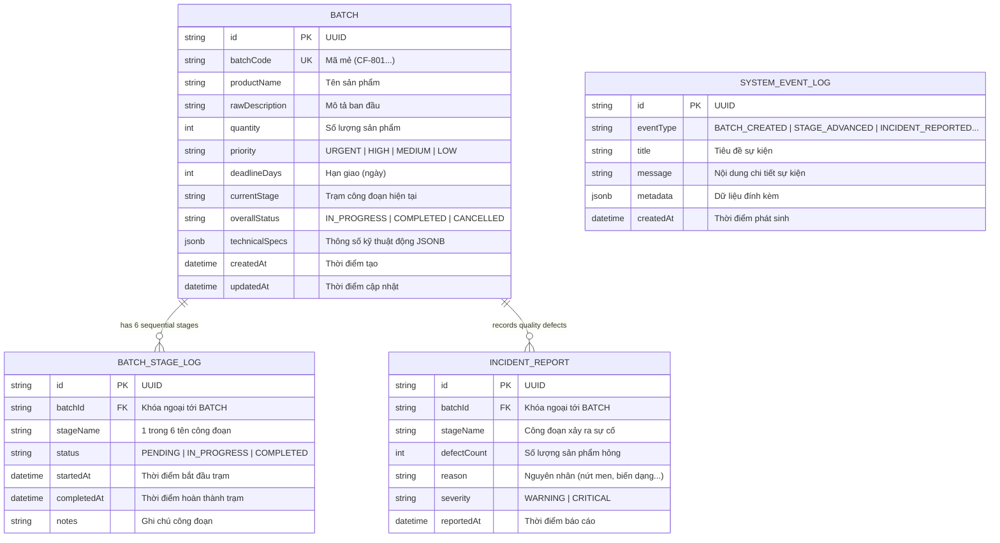

# 🗄️ TÀI LIỆU KIẾN TRÚC CƠ SỞ DỮ LIỆU (DATABASE ARCHITECTURE & DATA DICTIONARY)
## Hệ Thống CeramixFlow MES (PostgreSQL + Prisma ORM + JSONB)

---

## 1. TRIẾT LÝ THIẾT KẾ: HYBRID RELATIONAL + JSONB SCHEMA

Trong ngành sản xuất gốm sứ mỹ nghệ, dữ liệu được chia làm 2 nhóm bản chất:
1. **Dữ liệu Nghiệp vụ Cốt lõi (Structured Relational Data):** Cần tính toàn vẹn (ACID Transaction), khóa ngoại, ràng buộc duy nhất và đánh chỉ mục để phân trang, lọc và điều phối (ví dụ: mã mẻ, tên, số lượng, trạng thái, thời hạn).
2. **Thông số Kỹ thuật Động (Unstructured/Semi-Structured Specs):** Mỗi loại sản phẩm (ấm chén, bình hoa, chum ngâm rượu, tượng gốm) có hàng chục thông số kỹ thuật khác biệt (nhiệt độ lò, loại men, tỷ lệ co ngót, thời gian giữ nhiệt đỉnh Soaking, kỹ thuật bọc đồng viền miệng...).

### Bảng So Sánh Lựa Chọn Kiến Trúc:

| Tiêu Chí | SQL Thuần (MySQL / Postgres thường) | NoSQL Thuần (MongoDB) | **Kiến Trúc Lai Hybrid (PostgreSQL + JSONB)** |
| :--- | :--- | :--- | :--- |
| **Tính toàn vẹn (ACID)** | Rất cao | Thấp / Phức tạp khi scale | **Tối đa (Đảm bảo 100% khi chuyển trạm State Machine)** |
| **Tính linh hoạt thuộc tính** | Kém (phải ALTER TABLE khi thêm thông số) | Rất cao | **Rất cao (Lưu JSONB động không cần migrate DB)** |
| **Hiệu năng truy vấn & Index** | Tốt trên các cột cố định | Tốt trên document | **Xuất sắc (B-Tree cho cột cố định + GIN Index cho JSONB)** |
| **Phù hợp ngành sản xuất** | Cồng kềnh, sinh nhiều cột NULL | Dễ mất nhất quán trạng thái | **Lý tưởng nhất cho hệ thống MES điều hành sản xuất** |

---

## 2. SƠ ĐỒ THỰC THỂ QUAN HỆ (ENTITY RELATIONSHIP DIAGRAM - ERD)



---

## 3. TỪ ĐIỂN DỮ LIỆU CHI TIẾT (DATA DICTIONARY)

### 3.1 Bảng `batches` (Quản lý Thông Tin Mẻ Gốm)
Bảng trung tâm lưu trữ thông tin nhận diện, tiến độ sản xuất và thông số kỹ thuật động của từng mẻ.

| Tên Cột | Kiểu Dữ Liệu | Khóa | Nullable | Giá Trị Mặc Định | Mô Tả Nghiệp Vụ |
| :--- | :--- | :---: | :---: | :--- | :--- |
| `id` | `VARCHAR(36)` | **PK** | No | `uuid()` | Khóa chính duy nhất định danh mẻ gốm |
| `batchCode` | `VARCHAR(30)` | **UK** | No | - | Mã hiển thị thân thiện (ví dụ: `CF-801`, `CF-802`) |
| `productName` | `VARCHAR(255)` | - | No | - | Tên định danh dòng sản phẩm gốm sứ |
| `rawDescription` | `TEXT` | - | No | - | Chuỗi mô tả tiếng Việt tự nhiên ban đầu |
| `quantity` | `INTEGER` | - | No | `1` | Số lượng sản phẩm yêu cầu trong mẻ |
| `priority` | `VARCHAR(20)` | - | No | `'MEDIUM'` | Mức độ ưu tiên (`URGENT`, `HIGH`, `MEDIUM`, `LOW`) |
| `deadlineDays` | `INTEGER` | - | Yes | `NULL` | Số ngày yêu cầu hoàn thành (phục vụ EDD) |
| `currentStage` | `VARCHAR(50)` | - | No | `'TAO_HINH_MOC'` | Công đoạn hiện tại trong quy trình 6 bước |
| `overallStatus` | `VARCHAR(30)` | - | No | `'IN_PROGRESS'` | Trạng thái tổng (`IN_PROGRESS`, `COMPLETED`, `CANCELLED`) |
| `technicalSpecs` | **`JSONB / TEXT`** | - | No | - | Toàn bộ thuộc tính kỹ thuật động do AI bóc tách |
| `createdAt` | `TIMESTAMP` | - | No | `now()` | Thời điểm tạo mẻ trong hệ thống (FIFO) |
| `updatedAt` | `TIMESTAMP` | - | No | `now()` | Thời điểm cập nhật dữ liệu gần nhất |

---

### 3.2 Bảng `batch_stage_logs` (Nhật Ký 6 Công Đoạn Liên Hoàn)
Quản lý lịch sử và thời gian thực thi tại từng trạm trong dây chuyền sản xuất.

| Tên Cột | Kiểu Dữ Liệu | Khóa | Nullable | Mô Tả Nghiệp Vụ |
| :--- | :--- | :---: | :---: | :--- |
| `id` | `VARCHAR(36)` | **PK** | No | Khóa chính của bản ghi tiến độ trạm |
| `batchId` | `VARCHAR(36)` | **FK** | No | Khóa ngoại tham chiếu tới `batches.id` (ON DELETE CASCADE) |
| `stageName` | `VARCHAR(50)` | - | No | Tên công đoạn (`TAO_HINH_MOC`, `PHOI_SUA_MOC`, `VE_HOA_TIET`, `TRANG_MEN`, `VAO_LO_NUNG`, `QC_DONG_GOI`) |
| `status` | `VARCHAR(30)` | - | No | Trạng thái trạm (`PENDING`, `IN_PROGRESS`, `COMPLETED`) |
| `startedAt` | `TIMESTAMP` | - | Yes | Thời điểm mẻ gốm bắt đầu vào trạm |
| `completedAt` | `TIMESTAMP` | - | Yes | Thời điểm mẻ gốm hoàn tất tại trạm |
| `notes` | `TEXT` | - | Yes | Ghi chú vận hành của thợ trưởng trạm |

---

### 3.3 Bảng `incident_reports` (Báo Cáo Sự Cố & Phế Phẩm QC)
Ghi nhận các sự cố chất lượng tại bất kỳ công đoạn nào để phục vụ truy vết và thống kê.

| Tên Cột | Kiểu Dữ Liệu | Khóa | Nullable | Mô Tả Nghiệp Vụ |
| :--- | :--- | :---: | :---: | :--- |
| `id` | `VARCHAR(36)` | **PK** | No | Khóa chính của báo cáo sự cố |
| `batchId` | `VARCHAR(36)` | **FK** | No | Khóa ngoại tham chiếu tới `batches.id` |
| `stageName` | `VARCHAR(50)` | - | No | Công đoạn phát hiện sự cố (thường là tại Lò Nung hoặc QC) |
| `defectCount` | `INTEGER` | - | No | Số lượng sản phẩm bị lỗi / hỏng / nứt vỡ |
| `reason` | `TEXT` | - | No | Chi tiết nguyên nhân (nứt men, bọt khí, quá nhiệt...) |
| `severity` | `VARCHAR(20)` | - | No | Mức độ nghiêm trọng (`WARNING`, `CRITICAL`) |
| `reportedAt` | `TIMESTAMP` | - | No | Thời điểm ghi nhận sự cố |

---

### 3.4 Bảng `system_event_logs` (Audit Log & Live Event Stream)
Lưu vết toàn bộ hoạt động của hệ thống phục vụ Live Telegram Feed và kiểm toán nghiệp vụ.

| Tên Cột | Kiểu Dữ Liệu | Khóa | Nullable | Mô Tả Nghiệp Vụ |
| :--- | :--- | :---: | :---: | :--- |
| `id` | `VARCHAR(36)` | **PK** | No | Khóa chính của log sự kiện |
| `eventType` | `VARCHAR(50)` | - | No | Loại sự kiện (`BATCH_CREATED`, `STAGE_ADVANCED`, `INCIDENT_REPORTED`...) |
| `title` | `VARCHAR(255)` | - | No | Tiêu đề tóm tắt sự kiện |
| `message` | `TEXT` | - | No | Nội dung chi tiết thông báo |
| `metadata` | `TEXT / JSON` | - | Yes | Dữ liệu ngữ cảnh bổ sung dạng JSON |
| `createdAt` | `TIMESTAMP` | - | No | Thời gian phát sinh sự kiện |

---

## 4. CẤU TRÚC CHI TIẾT CỘT `technical_specs (JSONB)`

Cột `technical_specs` lưu trữ đối tượng JSON linh hoạt do AI bóc tách và người dùng kiểm duyệt:

```json
{
  "dimensions": {
    "height_cm": 35,
    "diameter_cm": 21
  },
  "estimated_clay_kg": 160.0,
  "glaze_type": "Men lam Bát Tràng cổ truyền",
  "firing_specs": {
    "target_temperature_c": 1280,
    "estimated_duration_hours": 14,
    "firing_curve": "Nung khử khí gas tuần hoàn"
  },
  "craft_technique": "Vuốt tay bàn xoay kết hợp tiện mộc thủ công",
  "artwork_details": "Vẽ hoa sen liên hoa thủy mặc xanh coban",
  "custom_rank": 1,
  "custom_attributes": {
    "Tỷ lệ co ngót nhiệt": "12.5%",
    "Độ ẩm phôi mộc": "16%",
    "Kỹ thuật viền miệng": "Bọc đồng thủ công chữ Vạn",
    "Thời gian giữ nhiệt đỉnh (Soaking)": "120 phút",
    "Áp suất buồng lò nung": "0.05 MPa"
  },
  "additional_notes": [
    "Đã tính kèm 15% hao hụt nguyên liệu khi tiện gọt",
    "Thời gian ủ men tối thiểu 24 giờ trước khi vào lò"
  ]
}
```

---

## 5. CHIẾN LƯỢC TỐI ƯU HÓA (PERFORMANCE & INDEXING)

1. **B-Tree Indexing trên các cột truy vấn thường xuyên:**
   - `batches.batchCode` (Unique Index - tìm kiếm nhanh mã mẻ).
   - `batches.currentStage` & `batches.overallStatus` (Index phục vụ phân chia 6 cột Kanban).
   - `batches.priority` & `batches.createdAt` (Index phục vụ thuật toán sắp xếp đa tầng).
2. **Connection Pooling Strategy (Supabase PgBouncer):**
   - **`DATABASE_URL` (Port 6543):** Chế độ Transaction Pooling với PgBouncer giúp quản lý hàng nghìn kết nối đồng thời từ Web client mà không làm nghẽn RAM server.
   - **`DIRECT_URL` (Port 5432):** Chế độ Session Mode phục vụ các lệnh migration và Prisma Client Push schema.
