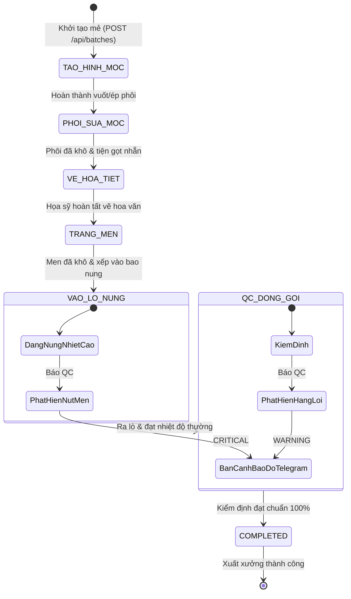

# ⚙️ TÀI LIỆU QUY TRÌNH STATE MACHINE & TÍCH HỢP TỰ ĐỘNG HÓA
## Hệ Thống Điều Phối CeramixFlow (State Machine & Automation Workflow)

---

## 1. MÁY TRẠNG THÁI 6 CÔNG ĐOẠN LIÊN HOÀN (FINITE STATE MACHINE - FSM)

Quy trình gia công và sản xuất gốm sứ trong CeramixFlow được vận hành theo mô hình Máy trạng thái hữu hạn tuần tự nghiêm ngặt (Strict Sequential State Machine) để đảm bảo không có mẻ gốm nào bị nhảy cóc công đoạn:



### Bảng Quy Tắc Chuyển Trạng Thái (Transition Matrix):

| Trạng Thái Hiện Tại | Hành Động Kích Hoạt | Trạng Thái Tiếp Theo | Tác Vụ Tự Động Kèm Theo |
| :--- | :--- | :--- | :--- |
| **`TAO_HINH_MOC`** | Bấm *Chuyển bước* hoặc Kéo thẻ | `PHOI_SUA_MOC` | Đóng trạm 1 (ghi `completedAt`), mở trạm 2 (ghi `startedAt`), bắn Telegram. |
| **`PHOI_SUA_MOC`** | Bấm *Chuyển bước* hoặc Kéo thẻ | `VE_HOA_TIET` | Đóng trạm 2, mở trạm 3, cập nhật log hệ thống. |
| **`VE_HOA_TIET`** | Bấm *Chuyển bước* hoặc Kéo thẻ | `TRANG_MEN` | Đóng trạm 3, mở trạm 4, bắn Telegram. |
| **`TRANG_MEN`** | Bấm *Chuyển bước* hoặc Kéo thẻ | `VAO_LO_NUNG` | Đóng trạm 4, kích hoạt hiệu ứng ngọn lửa lò (`flame-active`), gửi thông số nhiệt nung lên Telegram. |
| **`VAO_LO_NUNG`** | Bấm *Chuyển bước* hoặc Kéo thẻ | `QC_DONG_GOI` | Đóng trạm 5, mở trạm 6 để kiểm định thành phẩm ra lò. |
| **`QC_DONG_GOI`** | Bấm *Hoàn Thành Xuất Xưởng* | `COMPLETED` | Đổi `overallStatus = COMPLETED`, bắn thông báo chúc mừng xuất xưởng lên Telegram. |

---

## 2. THUẬT TOÁN ĐIỀU PHỐI ĐA TẦNG (MULTI-TIER SCHEDULING ALGORITHM)

Khi tại một trạm có nhiều mẻ gốm cùng hoạt động, hệ thống sử dụng thuật toán sắp xếp đa tầng 4 lớp để quyết định mẻ nào được ưu tiên xử lý trước:

```
                  ┌─────────────────────────────────────────────────┐
                  │ 1. CẤP ĐỘ ƯU TIÊN (Priority Level)              │
                  │    URGENT (1) > HIGH (2) > MEDIUM (3) > LOW (4) │
                  └────────────────────────┬────────────────────────┘
                                           │ (Nếu đồng cấp ưu tiên)
                                           ▼
                  ┌─────────────────────────────────────────────────┐
                  │ 2. THỨ TỰ KÉO THẢ THỦ CÔNG (custom_rank)        │
                  │    Chỉ định thủ công qua thao tác Drag & Drop   │
                  └────────────────────────┬────────────────────────┘
                                           │ (Nếu chưa từng kéo thả)
                                           ▼
                  ┌─────────────────────────────────────────────────┐
                  │ 3. HẠN HOÀN THÀNH SỚM NHẤT (Earliest Due Date)  │
                  │    Mẻ nào có deadline_days nhỏ hơn xếp trước    │
                  └────────────────────────┬────────────────────────┘
                                           │ (Nếu cùng hạn ngày)
                                           ▼
                  ┌─────────────────────────────────────────────────┐
                  │ 4. ĐẾN TRƯỚC PHỤC VỤ TRƯỚC (FIFO)               │
                  │    So sánh thời điểm tạo createdAt              │
                  └─────────────────────────────────────────────────┘
```

---

## 3. CÁC MẪU BẢN TIN TỰ ĐỘNG HÓA TELEGRAM (MESSAGE TEMPLATES)

### 3.1 Bản Tin Khởi Tạo Mẻ Sản Xuất Mới
```html
🏺 <b>[KHỞI TẠO MẺ GỐM MỚI] #CF-801</b>
📦 <b>Sản phẩm:</b> 200 Bình gốm họa tiết sen men lam cao 35cm
🎯 <b>Độ ưu tiên:</b> URGENT | ⏳ <b>Hạn hoàn thành:</b> 2 ngày

📋 <b>Thông Số Kỹ Thuật (AI Copilot):</b>
  • 🧱 <b>Đất sét ước tính:</b> 160.0 kg
  • 🔥 <b>Nhiệt độ nung:</b> 1280°C (Thời gian: 14h)
  • 🎨 <b>Loại men:</b> Men lam cổ truyền Bát Tràng
  • 📐 <b>Kích thước:</b> Cao 35cm, Đường kính 21cm
  • <b>Tỷ lệ co ngót nhiệt:</b> <code>12.5%</code>
  • <b>Kỹ thuật viền miệng:</b> <code>Bọc đồng thủ công chữ Vạn</code>

🚀 <i>Mẻ gốm đã chính thức bước vào Trạm 1: Tạo hình mộc!</i>
```

### 3.2 Bản Tin Chuyển Công Đoạn
```html
🚀 <b>[TIẾN ĐỘ SẢN XUẤT] #CF-801</b>
Mẻ <b>[200 Bình gốm họa tiết sen men lam cao 35cm]</b> đã hoàn thành công đoạn trước và chuyển sang:
📍 <b>Trạm 5: Vào lò nung</b> 🔥 (Nhiệt độ mục tiêu: 1280°C)
```

### 3.3 Bản Tin Cảnh Báo Đỏ Khẩn Cấp (QC Incident Red Alert)
```html
🚨 <b>[CẢNH BÁO ĐỎ QC - SỰ CỐ SẢN XUẤT]</b>
Mã mẻ: <b>#CF-808</b>
Sản phẩm: <b>50 Bình hút tài lộc mạ vàng</b>
Công đoạn phát hiện: <b>Vào lò nung (Nung 1300°C)</b>

⚠️ <b>Số lượng phế phẩm:</b> 5 sản phẩm
⚠️ <b>Mức độ:</b> CRITICAL
📝 <b>Nguyên nhân:</b> Nhiệt độ đỉnh vượt ngưỡng làm nứt men đáy và biến dạng miệng bình.

👉 <i>Quản đốc xưởng vui lòng kiểm tra ngay để kịp thời lên phương án sản xuất bù!</i>
```
