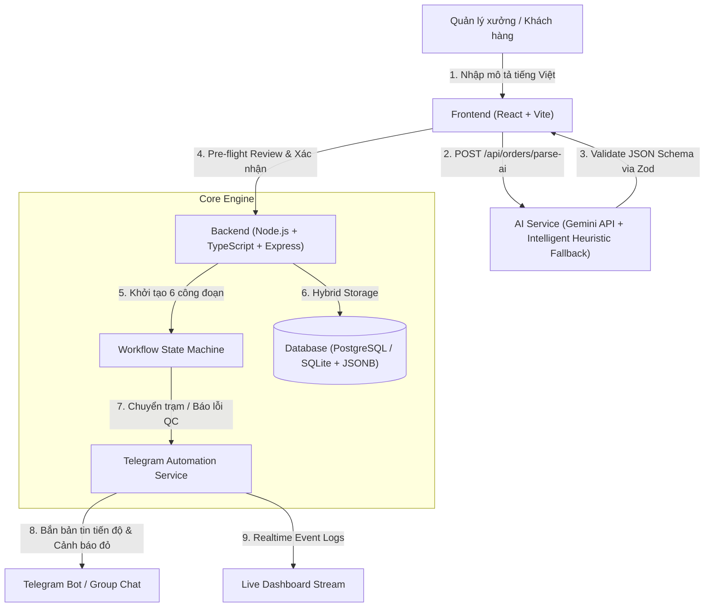

# 🏺 CeramixFlow - Hệ Thống Điều Phối & Giám Sát Quy Trình Sản Xuất Xưởng Gốm

> **Bài Test Đánh Giá Năng Lực Kỹ Thuật (Intern/Fresher) – Automation & AI Development**  
> **Đề 2:** Ceramics Manufacturing Pipeline & Monitoring System

---

## 📑 Mục Lục
1. [Giới Thiệu Bài Toán & Mục Tiêu](#-giới-thiệu-bài-toán--mục-tiêu)
2. [Công Nghệ Sử Dụng (Tech Stack)](#-công-nghệ-sử-dụng-tech-stack)
3. [Sơ Đồ Kiến Trúc Hệ Thống (Architecture Blueprint)](#-sơ-đồ-kiến-trúc-hệ-thống)
4. [Tư Duy Thiết Kế: Dữ Liệu Cố Định vs Dữ Liệu Linh Hoạt](#-tư-duy-thiết-kế-dữ-liệu-cố-định-vs-dữ-liệu-linh-hoạt)
5. [Các Tính Năng Cốt Lõi (Core Features)](#-các-tính-năng-cốt-lõi)
6. [Hướng Dẫn Cài Đặt & Chạy Ứng Dụng (Quick Start)](#-hướng-dẫn-cài-đặt--chạy-ứng-dụng)
7. [Kịch Bản Video Demo (2 - 3 Phút)](#-kịch-bản-video-demo-2---3-phút)
8. [Các Câu Hỏi Phỏng Vấn Kỹ Thuật (Q&A Checklist)](#-các-câu-hỏi-phỏng-vấn-kỹ-thuật)

---

## 🎯 Giới Thiệu Bài Toán & Mục Tiêu

Trong các xưởng sản xuất gốm sứ truyền thống và hiện đại (như Bát Tràng, Chu Đậu), quy trình sản xuất trải qua nhiều công đoạn liên hoàn:
$$\text{Tạo hình mộc} \longrightarrow \text{Phơi sấy \& Sửa mộc} \longrightarrow \text{Vẽ họa tiết} \longrightarrow \text{Tráng men} \longrightarrow \text{Vào lò nung} \longrightarrow \text{QC \& Đóng gói}$$

### Khó khăn thực tế & Thách thức kỹ thuật:
- **Thiếu chuẩn hóa thông số nghiệp vụ ban đầu:** Mỗi dòng gốm thủ công (men lam, men rạn, men ngọc, men hoàng lưu...) có công thức phối liệu đất, nhiệt độ nung và thời gian giữ nhiệt hoàn toàn khác nhau.
- **Nếu hard-code vào các cột Database:** Khi xuất hiện dòng sản phẩm mới, schema cơ sở dữ liệu sẽ bị phá vỡ, đòi hỏi chạy migration (`ALTER TABLE`), gây downtime và tạo ra nhiều cột trống (`NULL`).
- **Mục tiêu của hệ thống:**
  1. Người dùng nhập yêu cầu bằng ngôn ngữ tự nhiên tiếng Việt.
  2. AI Agent phân tích, ước tính các thông số kỹ thuật (đất sét, loại men, nhiệt độ, thời gian nung) và trả về JSON chuẩn (validate bằng **Zod**).
  3. Hệ thống điều phối quy trình 6 công đoạn theo mô hình State Machine.
  4. Bắn thông báo tiến độ và phát cảnh báo đỏ khẩn cấp khi có sự cố QC về Telegram theo thời gian thực.

---

## 🛠️ Công Nghệ Sử Dụng (Tech Stack)

Hệ thống được xây dựng hoàn toàn bằng các công nghệ hiện đại, đáp ứng đúng yêu cầu của bài test:

| Thành Phần | Công Nghệ / Thư Viện | Mục Đích & Vai Trò Trong Dự Án |
| :--- | :--- | :--- |
| **Backend Core** | **Node.js + TypeScript** | Môi trường runtime và ngôn ngữ lập trình an toàn kiểu dữ liệu (Type Safety) cho toàn bộ API backend. |
| **Web Framework** | **Express.js** | Xây dựng RESTful API xử lý nhận đơn, chuyển trạng thái công đoạn và ghi nhận sự cố QC. |
| **Database & ORM** | **PostgreSQL + Prisma ORM** *(hỗ trợ SQLite profile cho local dev)* | Quản lý dữ liệu quan hệ kết hợp cột **`JSONB`** để lưu thông số kỹ thuật linh hoạt; Prisma giúp type-safe queries và migrations tự động. |
| **AI Integration** | **Google Gemini API (`gemini-1.5-flash`)** | LLM Agent bóc tách văn bản tiếng Việt tự nhiên, suy luận thông số vật liệu và trả về JSON chuẩn. |
| **Data Validation** | **Zod** | Validate schema dữ liệu nghiêm ngặt ở tầng ứng dụng, phòng ngừa lỗi hallucination hoặc schema mismatch từ AI. |
| **Fallback Engine** | **Domain-Specific Heuristics (Regex & Calculation Formula)** | Bộ phân tích dự phòng thông minh giúp hệ thống luôn hoạt động mượt 100% kể cả khi chưa có API Key hoặc bị gián đoạn mạng. |
| **Messaging & Bot** | **Telegram Bot API (`node-telegram-bot-api`)** | Tự động phát bản tin tiến độ mẻ gốm và kích hoạt **Cảnh báo đỏ khẩn cấp** khi có lỗi sản xuất/hàng hỏng. |
| **Frontend UI** | **ReactJS 18 + TypeScript + Vite** | Single Page Application (SPA) hiệu năng cao, xây dựng Dashboard và Kanban board tương tác kéo/chuyển trạng thái. |
| **Design System** | **Vanilla CSS + Glassmorphism** | Giao diện tối ưu thẩm mỹ, phối màu lấy cảm hứng từ gốm sứ truyền thống (Xanh Coban, Đất nung Terracotta, Men ngọc Celadon). |
| **Icons & Typography** | **Lucide React + Plus Jakarta Sans + Space Grotesk** | Hệ thống icon và font chữ hiện đại, trực quan cho dashboard điều hành sản xuất. |

---

## 🏗️ Sơ Đồ Kiến Trúc Hệ Thống



---

## 💡 Tư Duy Thiết Kế: Dữ Liệu Cố Định vs Dữ Liệu Linh Hoạt

### 1. Dữ liệu Cố định (Core Business Relational Data)
Lưu trữ trong các cột SQL truyền thống để phục vụ Index, lọc, phân trang, và điều phối luồng:
- **`batch_code`:** Mã mẻ sản xuất (ví dụ `#GOM-88`).
- **`product_name`, `quantity`, `priority`:** Tên sản phẩm, số lượng, độ ưu tiên (`LOW`, `MEDIUM`, `HIGH`, `URGENT`).
- **`current_stage`, `overall_status`:** Vị trí công đoạn hiện tại và trạng thái tổng thể.
- **`deadline_days`, `created_at`:** Hạn hoàn thành và mốc thời gian.

### 2. Dữ liệu Linh hoạt (Dynamic Technical Specs via `JSONB`)
Lưu trữ trong cột `technical_specs (JSONB)` của PostgreSQL:
```json
{
  "dimensions": { "height_cm": 35, "diameter_cm": 20 },
  "estimated_clay_kg": 345,
  "glaze_type": "Men lam Bát Tràng truyền thống",
  "firing_specs": {
    "target_temperature_c": 1280,
    "estimated_duration_hours": 14,
    "firing_curve": "Nung khử khí gas tuần hoàn"
  },
  "craft_technique": "Vuốt tay bàn xoay & tiện mộc",
  "artwork_details": "Vẽ tay hoa sen thủy mặc xanh coban",
  "additional_notes": ["Hao hụt dự tính 15%", "Giữ nhiệt đỉnh lò 2.5 giờ"]
}
```

### Tại sao chọn mô hình này?
- **Khả năng mở rộng (Extensibility):** Khi xưởng bổ sung các thông số mới (như `shrinkage_rate`, `cooling_rate`, `glaze_thickness`), hệ thống không cần thay đổi cấu trúc bảng.
- **Độ tin cậy cao:** Đảm bảo tính toàn vẹn Transaction (ACID) của SQL cho trạng thái sản xuất, đồng thời đạt được sự linh hoạt như NoSQL cho các thông số kỹ thuật.
- **AI-Proof:** Kết hợp thư viện `Zod` để kiểm soát chặt chẽ kiểu dữ liệu trước khi lưu vào DB.

---

## ✨ Các Tính Năng Cốt Lõi

1. **AI Natural Language Extraction (LLM Copilot):**
   - Hỗ trợ phân tích câu tiếng Việt tự nhiên phức tạp.
   - Ước tính khối lượng đất sét dựa trên kích thước và số lượng (đã tính bù trừ 15% hao hụt khi tiện gọt).
   - Tự động suy luận nhiệt độ nung (1250°C - 1300°C cho men lam/rạn nung cao; 1050°C - 1150°C cho men nhẹ nhiệt).
   - **Tích hợp sẵn bộ phân tích Heuristic thông minh** để hệ thống hoạt động mượt mà 100% ngay cả khi chưa gắn API Key.
2. **Pre-flight Review Modal:**
   - Cho phép Quản đốc xem trước, chỉnh sửa thông số và duyệt Raw JSON trước khi kích hoạt dây chuyền.
3. **Interactive 6-Stage Kanban Board:**
   - 6 cột biểu diễn 6 trạm xưởng gốm liên hoàn.
   - Hiệu ứng ngọn lửa lò nung (`flame-active`) trực quan tại trạm *Vào lò nung*.
   - Nút chuyển công đoạn tự động cập nhật State Machine.
4. **QC Incident Reporting & Telegram Red Alert:**
   - Thợ tại trạm báo cáo số lượng hàng lỗi và nguyên nhân (nứt men, biến dạng nhiệt...).
   - Hệ thống lập tức bắn thông báo **CẢNH BÁO ĐỎ KHẨN CẤP** về Telegram.
5. **Live Telegram & Automation Feed:**
   - Cửa sổ stream trực tiếp các sự kiện và tin nhắn Telegram ngay trên giao diện Web.
6. **1-Click Sample Prompts:**
   - Cung cấp 3 kịch bản mẫu giúp người chấm bài test ngay lập tức chỉ với 1 cú click chuột.

---

## 🚀 Hướng Dẫn Cài Đặt & Chạy Ứng Dụng

### Yêu cầu môi trường:
- **Node.js:** >= 18.x (khuyến nghị v20+)
- **npm:** >= 9.x

### Bước 1: Clone và Cài Đặt Dependencies
```bash
# Cài đặt toàn bộ dependencies cho backend và frontend trong 1 lệnh
npm run install:all
```

### Bước 2: Cấu hình Môi Trường (Tùy chọn)
Trong thư mục `backend/`, copy file cấu hình:
```bash
cd backend
cp .env.example .env
```
*(Nếu chưa điền API Key hoặc Telegram Bot Token, hệ thống sẽ tự động chuyển sang chế độ Mô Phỏng Thông Minh & Live Web Feed mà không bị lỗi).*

### Bước 3: Khởi chạy Database & Seeder
```bash
cd backend
npx prisma generate
npx prisma db push
npx ts-node-dev src/prisma/seed.ts
```

### Bước 4: Khởi Chạy Ứng Dụng
Mở 2 terminal riêng biệt:

**Terminal 1 - Backend:**
```bash
cd backend
npm run dev
# Server lắng nghe tại: http://localhost:5000
```

**Terminal 2 - Frontend:**
```bash
cd frontend
npm run dev
# Giao diện Web mở tại: http://localhost:5173
```

---

## 📹 Kịch Bản Video Demo (2 - 3 Phút)

| Thời Lượng | Nội Dung Trình Diễn | Điểm Nhấn Thuyết Minh |
| :--- | :--- | :--- |
| **0:00 - 0:45** | **Giới thiệu & Bóc tách AI:**<br>- Click nút Prompt mẫu: *"Đơn 200 Bình gốm sen men lam cao 35cm nung 1280°C..."*.<br>- Bấm *Bóc Tách & Ước Tính AI*.<br>- Mở modal Pre-flight Review, bấm xem Raw JSON Schema. | Giải thích: AI đóng vai trò Copilot ước tính khối lượng đất sét (345kg) và nhiệt độ lò (1280°C), Quản đốc duyệt trước khi bấm khởi tạo. |
| **0:45 - 1:45** | **Điều phối Kanban 6 bước & Telegram:**<br>- Bấm *Khởi Tạo Mẻ Sản Xuất* $\rightarrow$ Mẻ `#GOM-91` xuất hiện ở Trạm 1.<br>- Bấm *Chuyển Sang Bước 2, 3...* $\rightarrow$ Xem Live Telegram Feed nhận thông báo. | Giải thích kiến trúc State Machine đa bước và Event-driven Telegram notification. |
| **1:45 - 2:30** | **Báo Cáo Sự Cố QC & Cảnh Báo Đỏ:**<br>- Bấm *Báo Sự Cố QC* $\rightarrow$ Nhập lỗi *"10 sản phẩm nứt men"*, chọn mức *CRITICAL*.<br>- Bấm *Bắn Cảnh Báo Đỏ* $\rightarrow$ Quan sát thông báo đỏ khẩn cấp. | Thao tác chứng minh xử lý tình huống ngoại lệ tại xưởng thực tế. |
| **2:30 - 3:00** | **Tổng kết Kiến Trúc Hybrid JSONB:**<br>- Mở modal Chi tiết kỹ thuật (icon `👁️`). | Nêu rõ lý do dùng PostgreSQL JSONB để hệ thống mở rộng linh hoạt mà không cần đổi schema. |

---

## ❓ Các Câu Hỏi Phỏng Vấn Kỹ Thuật

#### Q1: Tại sao không dùng Database NoSQL (như MongoDB) hoàn toàn mà lại dùng PostgreSQL Hybrid?
> **Trả lời:** Quy trình sản xuất xưởng gốm đòi hỏi tính toàn vẹn dữ liệu cực kỳ chặt chẽ (ACID Transaction khi chuyển trạng thái giữa các trạm, quan hệ 1-N giữa mẻ gốm và nhật ký công đoạn). PostgreSQL kết hợp cột `JSONB` vừa cung cấp tính năng Transaction mạnh mẽ của Relational DB, vừa có tính linh hoạt schema-less của NoSQL, đồng thời hỗ trợ GIN Index để truy vấn các thuộc tính kỹ thuật cực nhanh.

#### Q2: Làm sao đảm bảo AI không sinh ra JSON sai lệch gây crash Backend?
> **Trả lời:** Em sử dụng cơ chế kiểm soát 3 lớp:
> 1. *System Prompt Enforcing JSON MIME-type* trên LLM.
> 2. *Zod Schema Validation* ở tầng Node.js để kiểm tra kiểu dữ liệu và giá trị biên trước khi lưu.
> 3. *Fallback Engine* tự động kích hoạt khi LLM gặp sự cố hoặc vượt giới hạn rate limit.

#### Q3: Khi mở rộng cho nhiều xưởng và hàng trăm nghìn mẻ gốm, kiến trúc này scale như thế nào?
> **Trả lời:** Hệ thống có thể chuyển sang Event-Driven Architecture bằng cách đưa sự kiện chuyển trạm vào hàng đợi Message Queue (RabbitMQ / Redis BullMQ), Notification Service sẽ xử lý bất đồng bộ mà không làm chậm API chính của người dùng.
