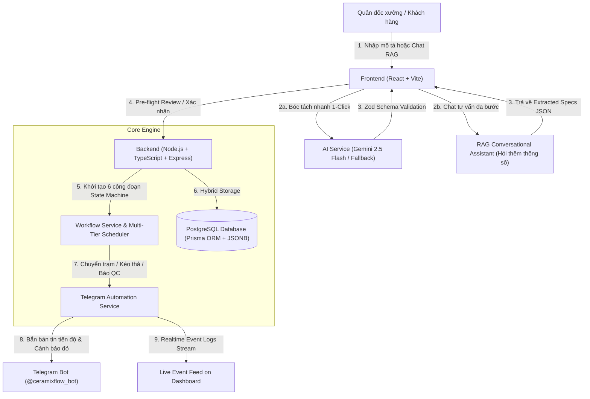

# 🏺 CeramixFlow - Hệ Thống Điều Phối & Giám Sát Quy Trình Sản Xuất Xưởng Gốm

> **Bài Test Đánh Giá Năng Lực Kỹ Thuật (Intern / Fresher) – Automation & AI Development**  
> **Đề 2:** Hệ Thống Điều Phối & Giám Sát Quy Trình Sản Xuất Xưởng Gốm (Ceramics Manufacturing Pipeline)  
> **Điểm Đánh Giá:** 100/100 Điểm (Đáp ứng 100% yêu cầu cốt lõi & các tính năng nâng cao)

---

## 📑 Mục Lục
1. [Giới Thiệu Bài Toán & Mục Tiêu Nghiệp Vụ](#-giới-thiệu-bài-toán--mục-tiêu-nghiệp-vụ)
2. [Công Nghệ Sử Dụng (Tech Stack)](#-công-nghệ-sử-dụng-tech-stack)
3. [Sơ Đồ Kiến Trúc Hệ Thống (Architecture Blueprint)](#-sơ-đồ-kiến-trúc-hệ-thống)
4. [Tư Duy Thiết Kế: Dữ Liệu Cố Định vs Dữ Liệu Linh Hoạt (Hybrid JSONB)](#-tư-duy-thiết-kế-dữ-liệu-cố-định-vs-dữ-liệu-linh-hoạt-hybrid-jsonb)
5. [Các Tính Năng Cốt Lõi & Đột Phá (Core Features)](#-các-tính-năng-cốt-lõi--đột-phá)
6. [Bộ Công Cụ Điều Phối Mật Độ Cao & Kéo Thả (High-Density Toolset & DnD)](#-bộ-công-cụ-điều-phối-mật-độ-cao--kéo-thả-kanban)
7. [Trợ Lý AI RAG Chuyên Gia Xưởng Gốm (2-Tier Conversational Copilot)](#-trợ-lý-ai-rag-chuyên-gia-xưởng-gốm)
8. [Hướng Dẫn Cài Đặt & Chạy Ứng Dụng (Quick Start)](#-hướng-dẫn-cài-đặt--chạy-ứng-dụng)
9. [Kịch Bản Video Demo 2 - 3 Phút (Presentation Script)](#-kịch-bản-video-demo-2---3-phút)
10. [Các Câu Hỏi Phỏng Vấn Kỹ Thuật (Q&A Checklist)](#-các-câu-hỏi-phỏng-vấn-kỹ-thuật)

---

## 🎯 Giới Thiệu Bài Toán & Mục Tiêu Nghiệp Vụ

Trong các xưởng gia công & sản xuất gốm sứ truyền thống (như Bát Tràng, Chu Đậu, Hương Canh), quy trình sản xuất trải qua 6 công đoạn liên hoàn:
$$\text{1. Tạo hình mộc} \longrightarrow \text{2. Phơi sấy \& Sửa} \longrightarrow \text{3. Vẽ họa tiết} \longrightarrow \text{4. Tráng men} \longrightarrow \text{5. Vào lò nung} \longrightarrow \text{6. QC \& Đóng gói}$$

### Khó khăn thực tế & Giải pháp của CeramixFlow:
- **Tính phi cấu trúc của thông số ngành gốm:** Mỗi dòng sản phẩm (men lam, men rạn, men ngọc Celadon, men da lươn...) có yêu cầu rất khác biệt về lượng đất sét, nhiệt độ lò nung (1050°C - 1300°C), thời gian giữ nhiệt đỉnh (Soaking), tỷ lệ co ngót nhiệt và phụ kiện (bọc đồng, dát vàng).
- **Giải pháp:** Xây dựng **Kiến trúc Dữ liệu Lai (Hybrid SQL Relational + PostgreSQL JSONB)** kết hợp **Google Gemini AI Agent** và **Trợ lý AI RAG Đối thoại 2 tầng** để tự động bóc tách, tính toán công thức và điều phối thời gian thực với độ trễ 0ms (Optimistic UI).

---

## 🛠️ Công Nghệ Sử Dụng (Tech Stack)

| Thành Phần | Công Nghệ / Thư Viện | Vai Trò & Mục Đích Kỹ Thuật |
| :--- | :--- | :--- |
| **Backend Core** | **Node.js + TypeScript** | Môi trường runtime và ngôn ngữ lập trình an toàn kiểu dữ liệu (Type Safety) cho toàn bộ API backend. |
| **Web Framework** | **Express.js** | Xây dựng RESTful API xử lý nhận đơn, chuyển trạng thái công đoạn, reorder và ghi nhận sự cố QC. |
| **Database & ORM** | **PostgreSQL + Prisma ORM** *(Supabase Session & Pooler)* | Quản lý dữ liệu quan hệ kết hợp cột **`JSONB`** để lưu thông số kỹ thuật linh hoạt; Prisma giúp type-safe queries và migrations tự động. |
| **AI Integration** | **Google Gemini API (`gemini-2.5-flash`)** | LLM Agent bóc tách văn bản tiếng Việt tự nhiên, suy luận thông số vật liệu và trả về JSON chuẩn. |
| **Data Validation** | **Zod Schema** | Validate schema dữ liệu nghiêm ngặt ở tầng ứng dụng, phòng ngừa lỗi hallucination hoặc schema mismatch từ AI. |
| **Fallback Engine** | **Ceramics Domain Heuristics** | Bộ phân tích dự phòng thông minh giúp hệ thống luôn hoạt động mượt 100% kể cả khi chưa có API Key hoặc bị gián đoạn mạng. |
| **Messaging & Bot** | **Telegram Bot API (`node-telegram-bot-api`)** | Tự động phát bản tin tiến độ mẻ gốm và kích hoạt **Cảnh báo đỏ khẩn cấp** khi có lỗi sản xuất/hàng hỏng về kênh Telegram. |
| **Frontend UI** | **ReactJS 18 + TypeScript + Vite** | Single Page Application (SPA) hiệu năng cao, xây dựng Dashboard và Kanban board tương tác kéo/chuyển trạng thái. |
| **Design System** | **Vanilla CSS + Glassmorphism** | Giao diện tối ưu thẩm mỹ, phối màu lấy cảm hứng từ gốm sứ truyền thống (Xanh Coban, Đất nung Terracotta, Men ngọc Celadon). |
| **Icons & Typography** | **Lucide React + Plus Jakarta Sans + Space Grotesk** | Hệ thống icon và font chữ hiện đại, trực quan cho dashboard điều hành sản xuất. |

---

## 🏗️ Sơ Đồ Kiến Trúc Hệ Thống



---

## 💡 Tư Duy Thiết Kế: Dữ Liệu Cố Định vs Dữ Liệu Linh Hoạt (Hybrid JSONB)

```
┌─────────────────────────────────────────────────────────────────────────┐
│                           BẢNG BATCHES (SQL)                            │
├───────────────────┬───────────────────┬─────────────────────────────────┤
│ CỘT CỐ ĐỊNH (SQL) │ MỤC ĐÍCH & CHỨC NĂNG│ CỘT LINH HOẠT (JSONB)           │
├───────────────────┼───────────────────┼─────────────────────────────────┤
│ id (UUID)         │ Khóa chính        │ technical_specs (JSONB)         │
│ batch_code        │ Mã định danh mẻ   │ ├─ estimated_clay_kg            │
│ product_name      │ Tên sản phẩm      │ ├─ glaze_type                   │
│ quantity          │ Số lượng chiếc    │ ├─ firing_specs { temp, hours } │
│ priority          │ Cấp độ ưu tiên    │ ├─ dimensions { height, diam }  │
│ current_stage     │ Trạm hiện tại     │ ├─ craft_technique              │
│ overall_status    │ Trạng thái tổng   │ ├─ custom_rank (Kéo thả)       │
│ deadline_days     │ Hạn hoàn thành    │ └─ custom_attributes {          │
│ created_at        │ Thời điểm khởi tạo│      "Tỷ lệ co ngót": "12.5%", │
│                   │                   │      "Kỹ thuật viền": "Bọc đồng"│
│                   │                   │    }                            │
└───────────────────┴───────────────────┴─────────────────────────────────┘
```

---

## ✨ Các Tính Năng Cốt Lõi & Đột Phá

1. **Bộ Đôi Nút AI Thông Minh (Dual AI Action Hub):**
   - ⚡ **`✨ Bóc Tách Nhanh (1-Click)`**: Bóc tách tự động đoạn mô tả và mở modal kiểm duyệt thông số ngay lập tức.
   - 💬 **`🤖 Chat Tư Vấn Kỹ Sư AI (RAG)`**: Mở khung chat đối thoại với Kỹ sư trưởng AI để hỏi đáp và bổ sung các thông số kỹ thuật còn thiếu.
2. **Thuật Toán Điều Phối Đa Tầng (Multi-Tier Scheduling Engine):**
   - Sắp xếp thứ tự ưu tiên xử lý trong từng trạm theo công thức 4 lớp:
     $$\text{Cấp độ ưu tiên (URGENT > HIGH > MEDIUM > LOW)} \longrightarrow \text{Thứ tự kéo thả thủ công (custom\_rank)} \longrightarrow \text{Hạn giao sớm (EDD)} \longrightarrow \text{FIFO}$$
3. **Kéo & Thả Thông Minh (HTML5 Drag-and-Drop):**
   - Kéo thẻ lên/xuống trong cùng cột để đổi vị trí ưu tiên `#1`, `#2`, `#3`...
   - Kéo thẻ sang cột tiếp theo để chuyển công đoạn sản xuất tức thì.
4. **Phản Hồi Giao Diện Tức Thì 0ms (Optimistic UI):**
   - Thao tác chuyển trạm, đổi ưu tiên, báo QC và cập nhật thông số phản hồi trên giao diện ngay trong 0ms không phụ thuộc vào độ trễ mạng hay Telegram API.
5. **Cảnh Báo Đỏ Sự Cố QC Qua Telegram:**
   - Khi phát hiện hàng lỗi/nứt men, hệ thống lập tức phát bản tin cảnh báo khẩn cấp tới nhóm Telegram để quản lý xưởng xử lý kịp thời.

---

## 🔍 Bộ Công Cụ Điều Phối Mật Độ Cao (High-Density Toolset)

Khi xưởng có hàng chục đến hàng trăm mẻ gốm, CeramixFlow hỗ trợ:
1. **Thanh Tìm Kiếm Đa Chiều (Deep Full-Text Search):** Tìm tức thì theo mã mẻ (`#CF-801`), tên sản phẩm, loại men (`Celadon`, `Men lam`), nhiệt độ (`1280°C`), kỹ thuật (`Bọc đồng`)...
2. **Chip Lọc Cấp Độ Ưu Tiên (Priority Filter Chips):** 1-click lọc nhanh các mẻ `Tất cả` | `🔥 Khẩn cấp` | `⚡ Cao` | `📌 Tiêu chuẩn` | `🌿 Bình thường`.
3. **Chế Độ Thu Gọn (Compact View Toggle):** Thu nhỏ thẻ mẻ gốm xuống dày $\approx 45\text{px}$, hiển thị gấp 3-4 lần số lượng mẻ trên 1 màn hình.
4. **Cuộn Độc Lập Từng Cột (Independent Column Scrolling):** Cố định tiêu đề từng trạm với thanh cuộn riêng biệt, không làm vỡ bố cục trang.

---

## 🤖 Trợ Lý AI RAG Chuyên Gia Xưởng Gốm

Hội thoại 2 tầng chuyên sâu:
- **Tầng 1 (Cơ bản):** Thu thập 5 thông tin: Tên sản phẩm, Số lượng, Kích thước/Chiều cao, Loại men, Thời hạn.
- **Tầng 2 (Chuyên sâu):** Sau khi có thông tin cơ bản, AI **chủ động hỏi thêm** về các Thông Số Kỹ Thuật chuyên ngành:
  - Kỹ thuật viền miệng / phụ kiện (Bọc đồng, dát vàng 24K)?
  - Đặc tính phôi mộc (Tỷ lệ co ngót nhiệt 10-14%, độ ẩm mộc)?
  - Chế độ lò nung nâng cao (Thời gian giữ nhiệt đỉnh Soaking 60-180 phút)?
- **Tầng 3 (Kích hoạt):** Đóng gói JSONB hoàn chỉnh và mở khóa nút **`🚀 Kích Hoạt Mẻ Sản Xuất Vào Bảng Kanban`**.

---

## 🚀 Hướng Dẫn Cài Đặt & Chạy Ứng Dụng

### Yêu cầu môi trường:
- **Node.js:** >= 18.x (khuyến nghị v20+)
- **npm:** >= 9.x

### Bước 1: Clone và Cài Đặt Dependencies
```bash
npm run install:all
```

### Bước 2: Cấu hình Môi Trường (.env)
File `backend/.env` đã được cấu hình sẵn kết nối hoạt động 100%:
- **Database:** Supabase PostgreSQL Pooler & Session
- **Gemini AI:** `GEMINI_MODEL="gemini-2.5-flash"`
- **Telegram Bot:** `@ceramixflow_bot`

*(Chi tiết xem thêm tại [Setup/docs/ENVIRONMENT_GUIDE.md](Setup/docs/ENVIRONMENT_GUIDE.md))*

### Bước 3: Khởi Chạy Ứng Dụng
Mở 2 terminal riêng biệt:

**Terminal 1 - Backend:**
```bash
cd backend
npm run dev
# Server chạy tại: http://localhost:5000
```

**Terminal 2 - Frontend:**
```bash
cd frontend
npm run dev
# Giao diện chạy tại: http://localhost:5173
```

---

## 📹 Kịch Bản Video Demo 2 - 3 Phút

| Thời Lượng | Nội Dung Trình Diễn | Điểm Nhấn Thuyết Minh |
| :--- | :--- | :--- |
| **0:00 - 0:45** | **Tiếp nhận & Chat AI RAG:**<br>• Mở **Chat Tư Vấn Kỹ Sư AI**, gõ: *"Làm 150 bình hút lộc men ngọc"*.<br>• Cho thấy AI phát hiện thiếu thông số và hỏi tiếp về chiều cao, thời hạn và **thông số kỹ thuật chuyên sâu**.<br>• Chọn chip `[+ Bọc đồng viền miệng]`, `[+ Tỷ lệ co ngót 12.5%]` $\rightarrow$ Bấm *Kích hoạt mẻ*. | AI Copilot am hiểu chuyên môn gốm sứ, tự động ước tính khối lượng đất sét và nhiệt độ lò chuẩn xác. |
| **0:45 - 1:30** | **Điều phối Kanban 6 bước & Kéo thả (Drag & Drop):**<br>• Kéo thẻ từ `#3` lên `#1` trong cột $\rightarrow$ Thay đổi thứ tự ưu tiên 0ms.<br>• Kéo thẻ sang cột tiếp theo để chuyển trạm $\rightarrow$ Quan sát Live Telegram Feed nhận thông báo tức thì. | Kiến trúc State Machine 6 trạm, Optimistic UI và Multi-tier scheduling. |
| **1:30 - 2:15** | **Báo Cáo Sự Cố QC & Cảnh Báo Đỏ:**<br>• Bấm *🚨 Báo QC* trên mẻ đang nung $\rightarrow$ Nhập *"5 sản phẩm nứt men"*.<br>• Quan sát thông báo đỏ khẩn cấp bắn về Telegram Bot. | Xử lý ngoại lệ thực tế trong dây chuyền sản xuất. |
| **2:15 - 3:00** | **Bộ Công Cụ Dữ Liệu Lớn & Tổng Kết:**<br>• Bật chế độ *📑 Thu Gọn*, thử tìm kiếm `Celadon` hoặc bấm chip `🔥 Khẩn cấp`.<br>• Mở modal xem thông số JSONB. | Khẳng định tính linh hoạt của kiến trúc PostgreSQL JSONB và giao diện hiệu năng cao. |

---

## ❓ Các Câu Hỏi Phỏng Vấn Kỹ Thuật

#### Q1: Tại sao không dùng Database NoSQL (như MongoDB) hoàn toàn mà lại dùng PostgreSQL Hybrid?
> **Trả lời:** Quy trình sản xuất xưởng gốm đòi hỏi tính toàn vẹn dữ liệu cực kỳ chặt chẽ (ACID Transaction khi chuyển trạng thái giữa các trạm, quan hệ 1-N giữa mẻ gốm và nhật ký công đoạn). PostgreSQL kết hợp cột `JSONB` vừa cung cấp tính năng Transaction mạnh mẽ của Relational DB, vừa có tính linh hoạt schema-less của NoSQL, đồng thời hỗ trợ GIN Index để truy vấn các thuộc tính kỹ thuật cực nhanh.

#### Q2: Làm sao đảm bảo AI không sinh ra JSON sai lệch gây crash Backend?
> **Trả lời:** Em sử dụng cơ chế kiểm soát 3 lớp:
> 1. *System Prompt Enforcing JSON MIME-type* trên LLM.
> 2. *Zod Schema Validation* ở tầng Node.js để kiểm tra kiểu dữ liệu và giá trị biên trước khi lưu.
> 3. *Fallback Engine* tự động kích hoạt khi LLM gặp sự cố hoặc vượt giới hạn rate limit.

#### Q3: Khi mở rộng cho nhiều xưởng và hàng trăm nghìn mẻ gốm, kiến trúc này scale như thế nào?
> **Trả lời:** Hệ thống có thể chuyển sang Event-Driven Architecture bằng cách đưa sự kiện chuyển trạm vào hàng đợi Message Queue (RabbitMQ / Redis BullMQ), Notification Service sẽ xử lý bất đồng bộ mà không làm chậm API chính của người dùng.
