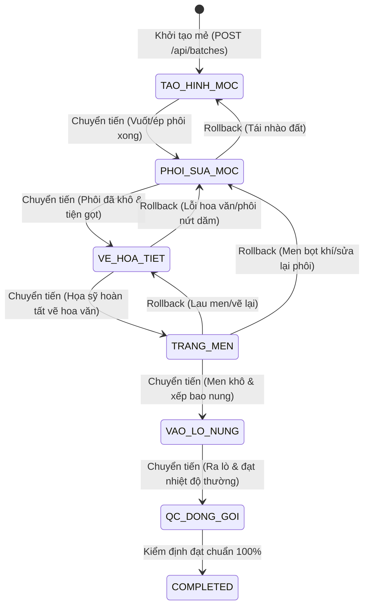

# ⚙️ TÀI LIỆU QUY TRÌNH STATE MACHINE & TÍCH HỢP TỰ ĐỘNG HÓA
## Hệ Thống Điều Phối CeramixFlow (State Machine & Automation Workflow)

---

## 1. MÁY TRẠNG THÁI 6 CÔNG ĐOẠN LIÊN HOÀN (FINITE STATE MACHINE - FSM)

Quy trình gia công và sản xuất gốm sứ trong CeramixFlow được vận hành theo mô hình Máy trạng thái hữu hạn với 2 luồng chuyển trạng thái: **Chuyển Tiến (Sequential Forward)** và **Điều Phối Lùi / Tái Chế Phôi Mộc (Rework Rollback)**:



---

## 2. QUY TẮC NGHIỆP VỤ ĐIỀU PHỐI LÙI (REWORK / ROLLBACK BUSINESS RULES)

1. **Phạm vi cho phép lùi (Greenware Stages):**
   - Chỉ các công đoạn **trước khi nung** (`TAO_HINH_MOC`, `PHOI_SUA_MOC`, `VE_HOA_TIET`, `TRANG_MEN`) mới được phép lùi công đoạn để cạo men, tiện lại phôi hoặc nhào lại đất.
   - Khi mẻ đã vào lò nung (`VAO_LO_NUNG`) hoặc xuất xưởng (`QC_DONG_GOI`), liên kết hóa học của đất và men đã bị biến đổi nhiệt bất thuận nghịch nên không thể lùi trạm.
2. **Hành vi hệ thống khi Rollback:**
   - Đặt lại trạng thái của trạm đích thành `IN_PROGRESS`.
   - Đặt lại toàn bộ các công đoạn sau trạm đích thành `PENDING`.
   - Ghi lý do điều phối lại vào bảng `batch_stage_logs` (Audit Log).
   - Phát cảnh báo điều phối lại tới kênh Telegram để các nghệ nhân nắm bắt thông tin.

---

## 3. CƠ CHẾ XÁC NHẬN HAI CHIỀU (WEB & TELEGRAM DUAL-CHANNEL)

```
┌────────────────────────────────────────┐       ┌────────────────────────────────────────┐
│             WEB DASHBOARD              │       │          TELEGRAM INLINE BOT           │
│   (Quản đốc click '➔ Bước' / Kéo thả)  │       │  (Thợ xưởng bấm '[✅ Xong Trạm X]')    │
└───────────────────┬────────────────────┘       └───────────────────┬────────────────────┘
                    │                                                │
                    ▼                                                ▼
         ┌──────────────────────────────────────────────────────────────────────┐
         │                  BACKEND IDEMPOTENCY & CONFLICT GUARD                │
         │  1. Kiểm tra trạng thái hiện tại (expectedStage == currentStage)     │
         │  2. Nếu trùng khớp -> Chuyển trạm & broadcast cập nhật               │
         │  3. Nếu đã bị trạm khác chuyển trước -> Bỏ qua an toàn (Idempotent)  │
         └──────────────────────────────────┬───────────────────────────────────┘
                                            │
                                            ▼
                               ┌─────────────────────────┐
                               │  POSTGRESQL TRANSACTION │
                               │  (Batch & Stage Log DB) │
                               └─────────────────────────┘
```

---

## 4. THUẬT TOÁN SẮP XẾP THỨ TỰ THẺ KANBAN (NATURAL SCHEDULING)

```
1️⃣ THỨ TỰ KÉO THẢ THỦ CÔNG (custom_rank do Quản đốc kéo thả)
   ➔ 2️⃣ THỜI ĐIỂM VÀO XƯỞNG (FIFO - First-In-First-Out: Mẻ nào vào trước làm trước)
```
